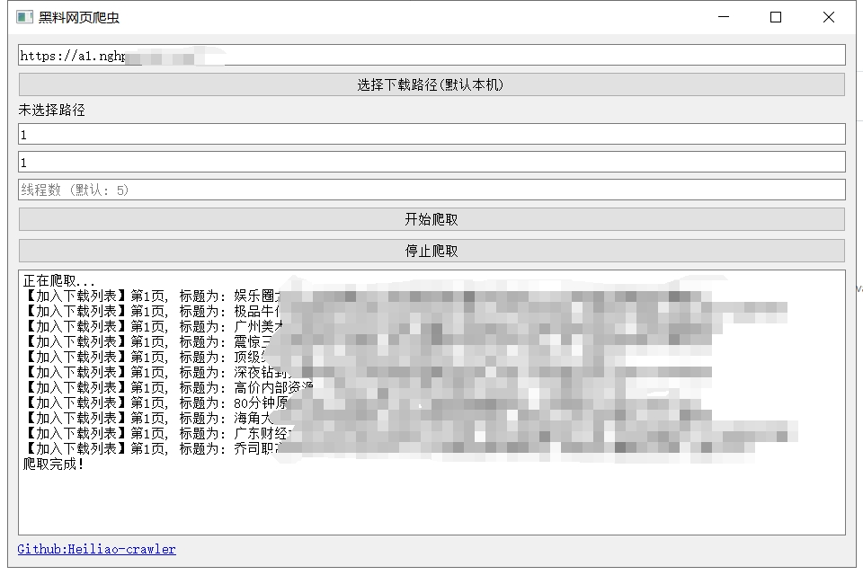

# Heiliao-crawler
```markdown
# 🕸️ 黑料爬虫 🕷️

## 特性 ✨

- 🌐 **并发支持**：
- 🚀 **高效快速**：
- 🔍 **精确提取**：

## 安装 📥

请确保保证目录格式如下：
/
├── Heiliao-crawler.exe
└── ffmpeg.exe

```

## 使用方法 📚

1. **下载Win版本**:[Release](https://github.com/palaemonboy/Heiliao-crawler/releases/)
2. **获取URL**: [导航页](https://155.fun/) 中任意域名
3. **运行爬虫**：请耐心等待因为还有视频，下载速度会比较慢
3. **查看结果**：爬虫运行完毕后，数据将会保存在本地目录中，或者你可以选择其他目录。



## 提示 ⚠️

请注意，这只是一个练习爬虫的项目，旨在帮助大家学习和练习爬虫技术。请勿传播或用于其他用途。

## 贡献 🤝

欢迎大家为本项目做出贡献！。

## 许可 📜

本项目采用MIT许可证。详情请参阅[LICENSE](LICENSE)文件。


感谢您的使用！希望本项目能为您提供帮助！🚀
```
